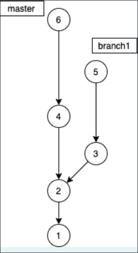

# Git Commit Rebase Example

### Извршени команди:

1. `git checkout branch1`
2. `git rebase master`

### Опис:

По извршувањето на командите, гранката `branch1` ќе ги преземе сите комити од гранката `master` и ќе ги постави на почетокот на гранката `branch1`. Комитите кои биле на `branch1` ќе бидат преместени врз комитите од `master`. Како резултат, редоследот на комитите на гранката `branch1` ќе биде:

### Редослед на commit-и:

1 - 2 - 4 - 6 - 3 - 5

- Комитите `1` и `2` се преместени од `branch1`.
- Комитите `4` и `6` се преземени од `master`.
- На крај, комитите `3` и `5` се наоѓаат на гранката `branch1` после rebase процесот.

### Објаснување:

По командата `git rebase master`, гранката `branch1` се поставува над сите комити од `master`, што создава нов редослед на commit-и: `1 - 2 - 4 - 6 - 3 - 5`.
